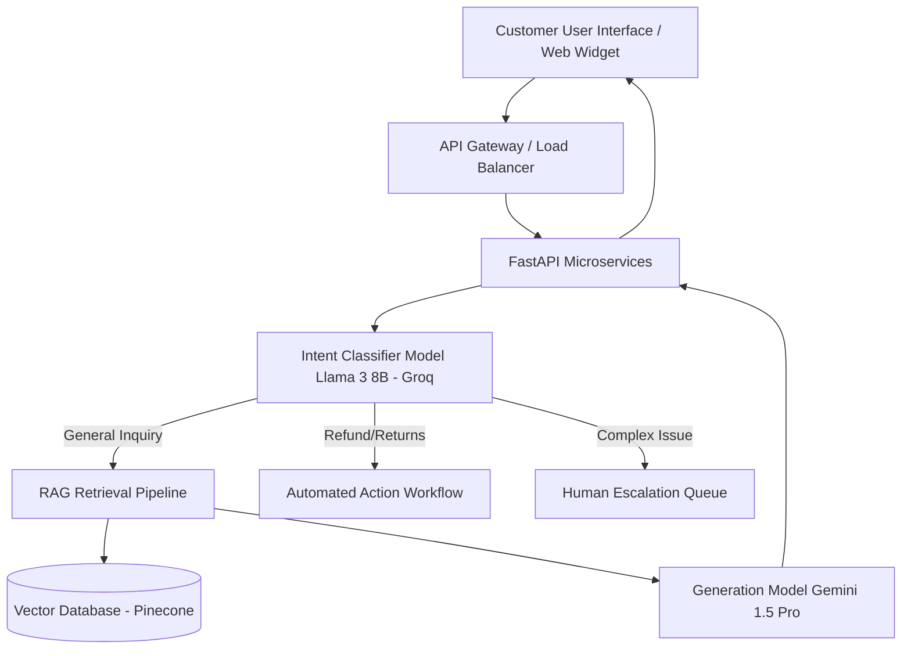

# Recommendation Report: Customer Support AI Agent

## 1. Recommended Architecture
To move from my local prototype to a robust, production-grade system, I recommend the following architecture:

## 2. Tool Selection Reasoning
- **FastAPI**: Ensures high concurrency and asynchronous performance, crucial for I/O-bound LLM API calls.
- **Groq API**: Offers unparalleled latency for the initial classification step, ensuring the user doesn't experience "thinking" delays just to be routed correctly.
- **Gemini API**: Highly capable of synthesizing context retrieved from the RAG system and generating empathetic, accurate support responses at a very accessible price point. I also rely on their Embedding API to save massive amounts of compute memory.
- **FAISS (Prototype) -> Pinecone (Production)**: FAISS is perfect for local prototyping and free-tier cloud deployment as it runs completely in-memory. For enterprise production, Pinecone offers fully-managed scalability and ultra-low latency across distributed clusters.

## 3. Estimated Infrastructure Costs (Production)
Assuming 10,000 support tickets per month:
- **Vector DB (Pinecone Standard)**: ~$70/month.
- **Classification (Groq Llama 3 8B)**: The free tier easily covers 10k short classification queries.
- **Generation & Embeddings (Gemini 1.5 Pro)**: ~$15/month (assuming ~1,000 tokens processed per interaction).
- **Compute (AWS ECS or Google Cloud Run)**: ~$20-40/month.
- **Total Expected Monthly Cost**: ~$100 - $125.

## 4. Risks and Limitations
1. **Hallucination**: The LLM might confidently invent policies not present in the knowledge base. 
   - *Mitigation: Strict LangChain system prompts and low temperature settings (0.1-0.2).*
2. **Context Window Limits**: If a customer provides a massive log file, the RAG prompt might overflow. 
   - *Mitigation: Implement chunking/summarization of user inputs before passing them to the RAG chain.*
3. **Latency**: Multiple API calls (Classification -> Embedding -> Retrieval -> Generation) can compound latency. 
   - *Mitigation: Stream responses to the frontend using Server-Sent Events (SSE).*

## 5. Production Scaling Strategy
- **Semantic Caching**: Implement Redis to cache the embeddings of frequent queries (e.g., "What is the return policy?") so they bypass the LLM entirely.
- **Asynchronous Processing**: Use message queues (RabbitMQ/Celery) if background tasks (like analyzing a massive PDF attachment) are required.
- **Evaluation Loop**: Implement a feedback mechanism (Thumbs Up/Down) in the UI. Log all poorly rated interactions to a database for weekly review, continuous prompt refinement, and fine-tuning.
